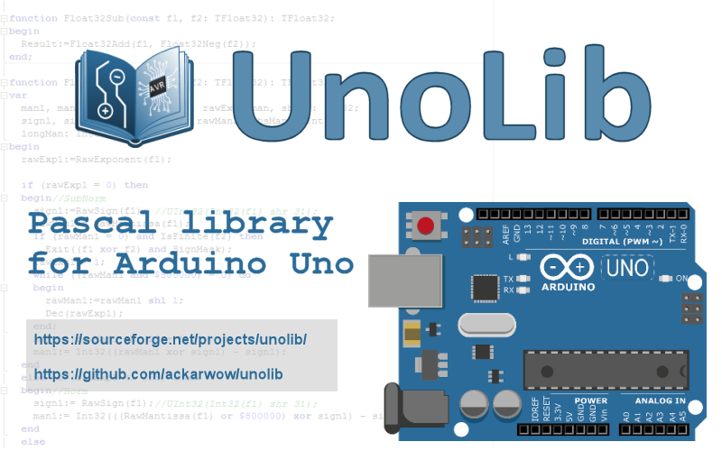

# UnoLib

**UnoLib** is a Pascal library designed for the Arduino Uno platform and [AVRPascal](http://akarwowski.pl/index.php?page=electronics&lang=en) or other editor using FPC 3.3.1 for AVR microcontrollers (e.g. FreePascal IDE, Lazarus).
It is a translation of a subset of the standard Arduino libraries, adapted as needed for a Pascal environment. Moreover, support for fixed-point and floating-point numbers has been added.

Written by @ackarwow in collaboration with @Dzandaa (from 2024).
Licensed under the MIT License. See LICENSE.txt for details.

Library modules included:

 - analog.pas - support for analog pins
 - defs.pas - definitions of constants, bit manipulations, port support
 - dht.pas - support for DHT11/22 sensors
 - digital.pas - support for digital pins
 - ds1302rtc.pas - support for DS1302 real time clock
 - fix16.pas - support for fixed point numbers
 - float32.pas - support for floating point numbers, basic arithmetic and trigonometric operations (in collaboration with @Dzandaa)
 - hardwareserial.pas - support for serial communication
 - i2c.pas - support for I2C communication bus (by @Dzandaa, many thanks to @ccrause)
 - liquidcrystal.pas - support for LCD
 - pulse.pas - routines for reading a pulse on a pin (additional function written by @Dzandaa returns length of the pulse in milliseconds)
 - stringutils.pas - string conversion routines (by @Dzandaa)
 - timer.pas - time-related routines
 - tone.pas - square wave tone routines

The library modules are located in the "lib" directory.

Documentation is placed in "docs" directory:

 - float32.pdf - documentation for float32.pas unit
 - stringutils.pdf - documentation for stringutils.pas unit

The "examples" directory contains simple sample programs using UnoLib modules:

 - DS137ZN_RTC_Test.pas - Real Time Clock test using I2C (by @Dzandaa)
 - HMC5883L_Magnetometer_Test.pas - HMC5883L Magnetometer test using I2C (by @Dzandaa)
 - I2CScan.pas - I2C bus scan (by @Dzandaa)
 - pcf8591t_ACDC_Read.pas - AC/DC read test (by @Dzandaa)
 - pcf8591t_ACDC_Write.pas - AC/DC write test (by @Dzandaa)
 - TestBlink.pas - turns on and off the built-in LED
 - TestBlinkWithoutDelay.pas - turns on and off the built-in LED using Millis
 - TestDHT11.pas - displays temperature and humidity from a DHT11 sensor on an LCD display
 - TestDigital.pas - turns on and off the built-in LED based on the button state
 - TestHC-SR04.pas - example of using HC-SR04 ultrasonic sensor
 - TestLCAutoscroll.pas - scrolls text on the LCD display
 - TestLCBlink.pas - displays the text "hello, world!" on the LCD display
 - TestLCChars.pas - displays non-standard characters on the LCD display
 - TestLCCursor.pas - turns the cursor on and off on the LCD display
 - TestLCDisplay.pas - displays and turns off the text "hello, world!"
 - TestLCSerialDisplay.pas - displays characters taken from the serial port on the LCD
display
 - TestLCTextDirection.pas - changes the direction of text display on the LCD display
 - TestLM35.pas - displays the temperature value from the LM35 sensor on the LCD
display
 - TestSerial.pas - sends and receives data via the serial port
 - TestTone.pas - plays a melody using _tone routine

Some extra code is placed in "extras" directory:

 - ccrause_blink_leonardo.pas - blink example for Arduino Leonardo based on code written by @ccrause
 - ccrause_delay.pas - delay module based on code written by @ccrause
 - ccrause_test_leonardo.pas - serial communication example for Arduino Leonardo based on code written by @ccrause
 - cdc.pas - CDC support for Arduino Leonardo
 - debug_leonardo.pas - simple LED-based debug code
 - usb.pas - USB support for Arduino Leonardo
 - wdt.pas - watchdog timer routines

Lazarus test projects are placed in "tests" directory:

- conversion - routines for numeric and string conversion and data preparation for CORDIC algorithm (by @Dzandaa with collaboration of @ackarwow)
- float32 - test programs for testing TFloat32 type both on Lazarus and on Arduino side (based on serial port communication program by @Dzandaa)
- serial - serial port communication test (by @Dzandaa)

Before compiling a given program, make sure that the library modules listed in the uses section
have already been compiled.

**Notice:**
UnoLib is distributed for educational and experimental use with microcontrollers.
It is not intended for safety-critical or life-support systems.

## Changes

### version 1.1 - 16/08/2025 (AVRPascal 3.3)

 - fixes in support for Arduino Leonardo

Many thanks to @ccrause for his suggestions and help

### version 1.0 - 28/07/2025

 - added square wave tone routines and example (ToneNoInt by @Myel)
 - added pulsein routines and example (pulseInMilli by @Dzandaa)
 - added i2c module and examples of its use (by @Dzandaa)
 - added sine table generation for conv2hexa (by @Dzandaa)

### version 0.9 - 21/01/2025 (AVRPascal 3.1)

 - added float32.pas module supporting 32-bit floating point numbers (in collaboration with @Dzandaa)
 - added test programs for serial communication, TFloat32, and conversions, placed in "tests" folder (written by @Dzandaa, some of them modified by @ackarwow)

@Dzandaa started collaborating on the development of UnoLib.

### version 0.8 - 09/12/2024 (AVRPascal 3.0)

 - added extra code for Arduino Leonardo ("extras" directory)
 - modified $IFDEF conditionals for compatibility with FPC 3.3.1 defines
 - inlined routines in defs.pas and timer.pas
 - added default result of functions in defs.pas
 - added THardwareSerial.ReadByte in hardwareserial.pas
 - added Fix16Sqrt routine in fix16.pas

Thanks to @Dzandaa for suggestions and implementation of THardwareSerial.ReadByte

### version 0.7 - 18/11/2024 (AVRPascal 2.9)
Changes in hardwareserial.pas:

 - added THardwareSerial.WriteBuff for writing buffer of bytes
 - added THardwareSerial.ReadBuff for reading buffer of bytes
 - THardwareSerial._begin renamed to THardwareSerial.Start, THardwareSerial._end renamed to THardwareSerial.Stop
 - added THardwareSerial.Read for Arduino compatibility

Many thanks to @Dzandaa, @ccrause, and @VisualLab for suggestions and discussion

### version 0.6 - 19/10/2024 (AVRPascal 2.6)

 - changed conditional directive, added arduinonano
 - fixed problem with millisecond counter in lib\timer.pas
 - added examples\TestBlinkWithoutDelay.pas

Thanks to Henk Heemstra for source code of TestBlinkWithoutDelay.pas

### version 0.5 - 18/07/2024 (AVRPascal 2.0)

 - changed conditional directive, atmega328p or arduinouno required

### version 0.4 - 31/10/2023 (AVRPascal 1.2)

 - added conditional compilation directive {ifndef} for atmega328p; requires AVRPascal installed

### version 0.3 - 28/09/2023 (AVRPascal 1.0)

 - minor technical changes

### version 0.2 - 18/04/2022

 - added hardwareserial.pas module

### version 0.1 - 06/01/2022

 - primary version

