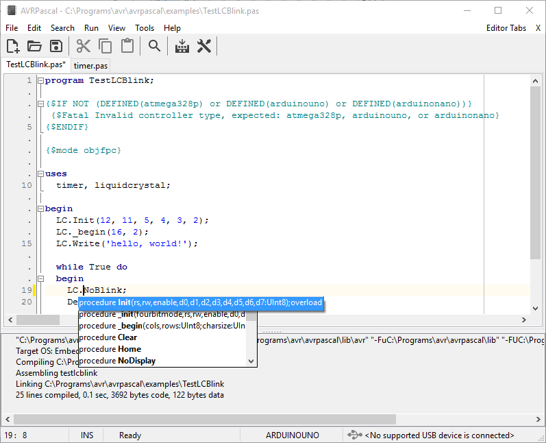

# UnoLib

**UnoLib** is a Pascal library designed for the Arduino Uno platform and [AVRPascal](http://akarwowski.pl/index.php?page=electronics&lang=en) or other editor using FPC 3.3.1 for AVR microcontrollers (e.g. FreePascal IDE, Lazarus).
It is a translation of a subset of the standard Arduino libraries, adapted as needed for a Pascal environment. Moreover, support for fixed point numbers has been added.

Library modules included:

 - analog.pas - support for analog pins
 - defs.pas - definitions of constatnts, bit manipulations, port support
 - dht.pas - support for DHT11/22 sensors
 - digital.pas - support for digital pins
 - ds1302rtc.pas - support for ds1302 real time clock
 - fix16.pas - support for fixed point numbers
 - float32.pas - support for floating point numbers, basic arithmetic and trigonometric operations (to be tested)
 - hardwareserial.pas - support for serial communication
 - liquidcrystal.pas - support for LCD
 - timer.pas - time-related routines

The library modules are located in the "lib" directory.

The "examples" directory contains simple sample programs using UnoLib modules:

 - TestBlink.pas - turns on and off the built-in LED
 - TestBlinkWithoutDelay.pas - turns on and off the built-in LED using Millis
 - TestDHT11.pas - displays information about the temperature and humidity of the air
from the DHT11 sensor on an external LCD display
 - TestDigital.pas - turns on and off the built-in LED based on the button state
 - TestLCAutoscroll.pas - scrolls text on the LCD display
 - TestLCBlink.pas - displays the text "hello, world!" on the LCD display
 - TestLCChars.pas - displays non-standard characters on the LCD display
 - TestLCCursor.pas - turns the cursor on and off on the LCD display
 - TestLCDisplay.pas - displays and turns off the text "hello, world!"
 - TestLCSerialDisplay.pas - displays characters taken from the serial port on the LCD
display
 - TestLCTextDirection.pas - changes the direction of text display on the LCD display
 - TestLM35.pas - displays the temperature value from the LM35 sensor on the LCD
display
 - TestSerial.pas - sends and receives data via the serial port

Some extra code is placed in "extras" directory:

 - ccrause_blink_leonardo.pas - blink example for Arduino Leonardo based on code written by @ccrause
 - ccrause_delay.pas - delay module based on code written by @ccrause
 - cdc.pas - CDC support for Arduino Leonardo
 - usb.pas - USB support for Arduino Leonardo
 - wdt.pas - watchdog timer routines

Lazarus test projects are placed in "tests" directory:

- serial - serial port communication test (courtesy of @Dzandaa)

Before compiling a given program, make sure that the library modules listed in the uses section
have already been compiled.

## Changes

### version 0.8 - 09/12/2024 (AVRPascal 3.0)

 - added extra code for Arduino Leonardo ("extras" directory)
 - modified $IFDEF conditionals for compatibility with FPC 3.3.1 defines
 - inlined routines in defs.pas and timer.pas
 - added default result of functions in defs.pas
 - added THardwareSerial.ReadByte in hardwareserial.pas
 - added Fix16Sqrt routine in fix16.pas

Thanks to @Dzandaa for suggestions and implementation of THardwareSerial.ReadByte

### version 0.7 - 18/11/2024 (AVRPascal 2.9)
changes in hardwareserial.pas:

 - added THardwareSerial.WriteBuff for writing buffer of bytes
 - added THardwareSerial.ReadBuff for reading buffer of bytes
 - THardwareSerial._begin renamed to THardwareSerial.Start, THardwareSerial._end renamed to THardwareSerial.Stop
 - added THardwareSerial.Read for Arduino compatibility

Many thanks to @Dzandaa, @ccrause, and @VisualLab for suggestions and discussion

### version 0.6 - 19/10/2024 (AVRPascal 2.6)

 - changed conditional directive, added arduinonano
 - fixed problem with millisecond counter in lib\timer.pas
 - added examples\TestBlinkWithoutDelay.pas

Thanks to Henk Heemstra for source code of TestBlinkWithoutDelay.pas

### version 0.5 - 18/07/2024 (AVRPascal 2.0)

 - changed conditional directive, atmega328p or arduinouno required

### version 0.4 - 31/10/2023 (AVRPascal 1.2)

 - added conditional compilation directive {ifndef} for atmega328p; requires AVRPascal installed

### version 0.3 - 28/09/2023 (AVRPascal 1.0)

 - minor technical changes

### version 0.2 - 18/04/2022

 - added hardwareserial.pas module

### version 0.1 - 06/01/2022

 - primary version

